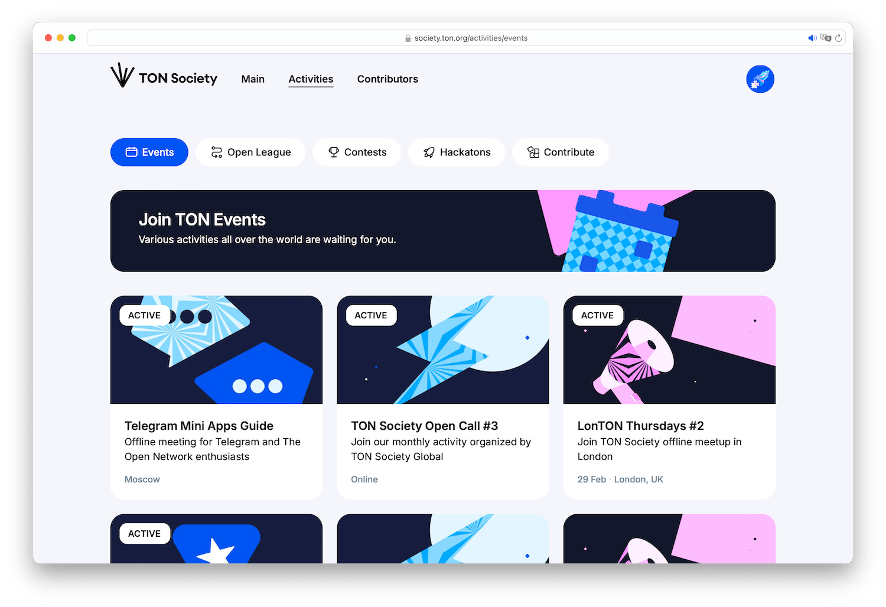
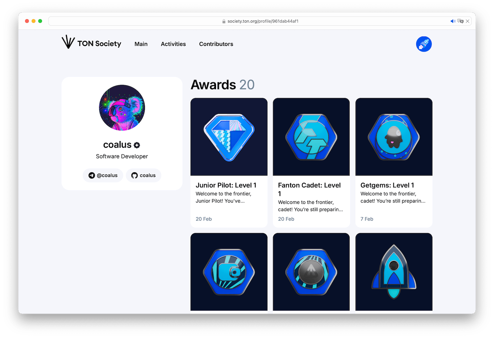
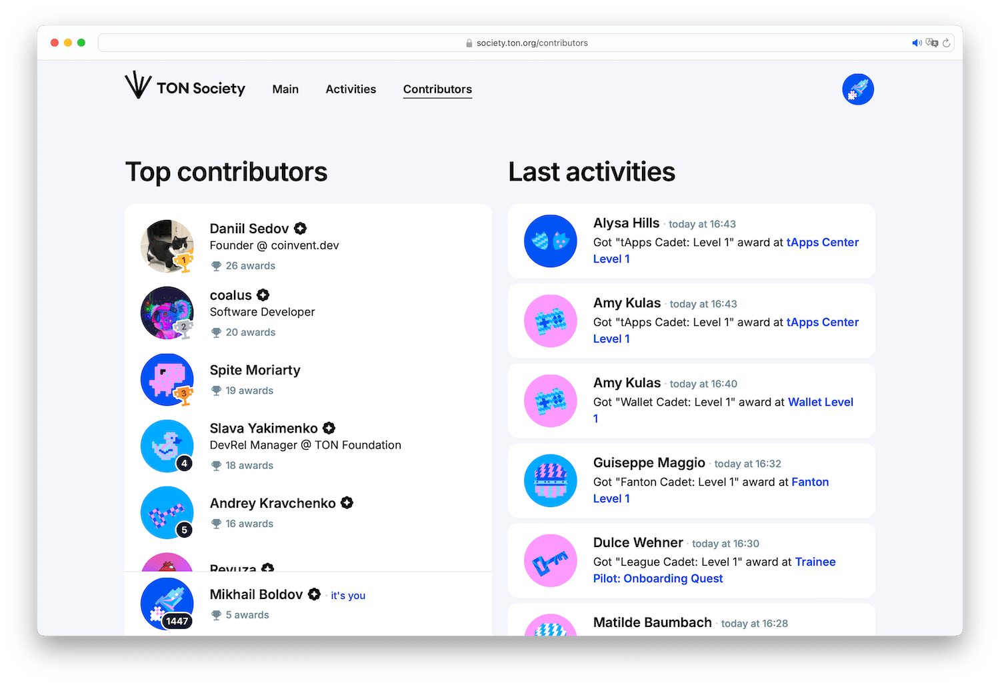

# TON Society Platform
TON Society involves people in various ecosystem activities with catalog and SBT rewards on activity completion.

This repository contains documentation helping ecosystem developers and projects to integrate with the platform and populate SBT usage on TON.

## Documentation
[SBT metadata standard](https://github.com/ton-developers/ton-society/blob/main/metadata.md) 
Proposal for aligning the metadata of SBTs issued on TON both by TON Society and ecosystem projects.

## How TON Society works
* Ecosystem activities (events, contests, hackathons, etc) are published at TON Society [Activity Catalog](https://society.ton.org/activities)
* Every person participated in some activity receive an SBT as a proof
* SBTs are displayed in person's profile among with info it decides to share
* Person activities form [leaderboard](https://society.ton.org/contributors) based on SBTs count and profile completion

